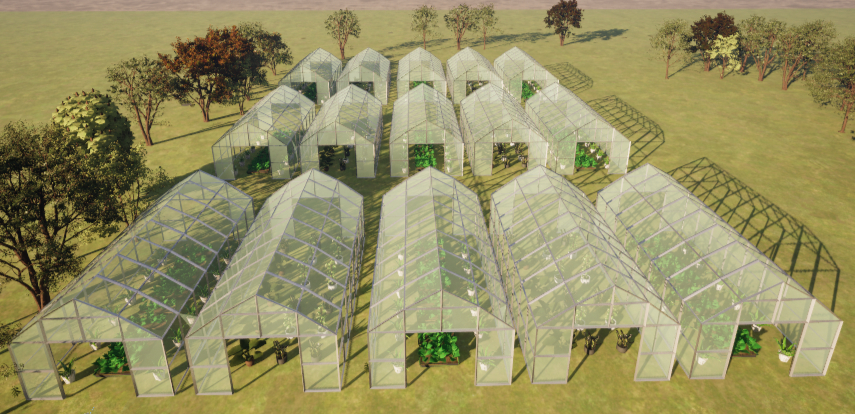

# AgriNav-Sim2Real: A Multi-Sensor Dataset for Drone/UGV Navigation in Greenhouses (Synthetic + Real)

> **TL;DR**: Unified dataset spanning Unreal/AirSim simulation, Insta360 capture, and farm-collected runs, with consistent folder layout, metadata, and starter loaders/baselines. Designed for learning perception-to-control policies under canopy/clutter using only RGB (optional Depth/Seg/IMU where available).

---

## 1) Project Overview

- **Data Sources**
  - **Synthetic (Unreal Engine + AirSim)**: RGB, **Depth**, **Semantic Segmentation**, **IMU**, ground-truth pose; controllable layout of 3×5 connected greenhouses; multiple flight patterns (loop, straight pass, zig-zag, in-out traversals).
  - **Real: Insta360 X3 360 Action Camera**: 360° RGB image and videos (equirectangular), and outdoor traversals around greenhouse structures.
  - **Real: Farm**: Handheld/drone/UGV forward-RGB and IMU; natural lighting, wind, and clutter.
- **Intended Tasks**: visual navigation, obstacle avoidance, segmentation, depth estimation, and policy learning (imitation/RL) with short-horizon control.
- **Why this dataset**: Combines clean synthetic supervision (depth/seg/pose) with real video realism for sim-to-real transfer; unified format means you can train once and evaluate everywhere.

> **At a glance (modalities)**
> - Synthetic: RGB, Depth, Seg, IMU, GT pose
> - Real—Insta360: RGB-360 (+EXIF/metadata)
> - Real—Farm: RGB (±Depth/IMU if available)


## Part A — Synthetic Dataset

### A.1 Environment Overview
*Engine & Sim:* Unreal Engine + AirSim with a 3×5 connected-greenhouse map, dynamic lights, wind, and clutter.

> **Visuals: Greenhouse Setup**
<table>
  <tr>
    <td align="center">
      <br>
      <em>Front view</em>
    </td>
    <td align="center">
      <br>
      <em>Side view</em>
    </td>
  </tr>
</table>


> **Demo Video**  
<p align="center">
  
</p>
<p align="center">
  <a href="docs/media/Drone_visualization_full.mp4">Watch full MP4</a>
</p>

### A.2 Canonical Routes (10)
Each synthetic sequence belongs to one of **Route #1 … Route #10**; these labels map to the `<route>` level in the folder tree.

<table>
  <tr>
    <td align="center">
      Route #1-8<br>
      
    </td>
    <td align="center">
      Route #9-10<br>
      
    </td>
  </tr>
</table>


### A.3 Folder Contents (Synthetic)
Our synthetic data follow a per-route structure; each route contains frame-indexed folders for sensors and two time-series logs.
Our per-frame filenames use **timestamp-based** (e.g., `1753292383498990645`) identifiers shared across modalities.
- `rgb/`, `depth/`, `seg/`, `imu.csv`, `gps.csv`, as detailed below.
- `scenes/` holds domain randomization configs (materials, textures, foliage density).
- `routes/` optional YAMLs describing waypoints used to generate the flights.

```swift
data/synthetic/routes/
├── route01_left/
│ ├── rgb/ # 1753292383498990645.png, ...
│ ├── depth/ # 1753292383498990645.pfm, ...
│ ├── semantic_mask/ # 1753292383498990645.png (uint8 class IDs)
│ ├── lidar/ # 1753292383498990645.asc (ASCII; x y z [intensity])
│ ├── imu.csv # timestamped IMU
│ ├── gps.csv # timestamped GPS
├── route02/
└── route10/
```

**Global simulator config (reproducibility).** 
All routes were captured with the same AirSim settings (stored at `data/synthetic/scenes/default/airsim_settings.json`). Key fields used during capture:
- **Sim mode:** `Multirotor`
- **CameraDefaults.CaptureSettings (ImageType 0/1/2/…):**
  - `Width=960, Height=540, FOV_Degrees=90`  *(these are the capture dimensions; the top-level `"Width":1280, "Height":720` is the UE window size, not capture)*  
- **Front camera pose (Drone1/Cameras/frontcamera):**
  - `X=0.25, Y=0, Z=-0.3, Roll=Pitch=Yaw=0`
- **LiDAR (Drone1/Sensors/lidar):**
  - `Enabled=true, NumberOfChannels=32, Range=120 m, RPS=10, MeasurementsPerCycle=1024`
  - Vertical FOV: `+26.8° … −24.8°`, Horizontal FOV: `0…360°`

> **Resolution note:** We record the actual frame size from the files in `rgb/`. If you change `CaptureSettings` between runs, prefer adding a small `meta.json` in that route to pin the exact resolution/fps.

**File formats & sync.**
- `rgb/`: `frame_<6-digit>.png|jpg`
- `depth/`: `depth_<6-digit>.pfm|fpm` *(float meters; PFM origin is bottom-left; loaders typically flip vertically)*
- `semantic_mask/`: `mask_<6-digit>.png` *(uint8 class IDs; optional `palette.json`)*
- `lidar/`: `lidar_<6-digit>.asc` lines: `x y z [intensity]` in sensor frame (meters)
- `imu.csv` header: timestamp, gyro_x, gyro_y, gyro_z, acc_x, acc_y, acc_z
- `gps.csv` header: timestamp, latitude, longitude, altitude

**AirSim settings file.** 
See the exact configuration in `data/synthetic/scenes/default/airsim_settings.json`.

### A.4 Camera intrinsics (Synthetic, summary)

- Capture: `W=960`, `H=540`, `HFOV=90°` → pinhole intrinsics (px):
  - `fx=480.0`, `fy=480.0`, `cx=480.0`, `cy=270.0`
- Distortion: all zeros (AirSim pinhole)
- Resize rule: scale `fx, fy, cx, cy` by the same width/height factors
- Crop rule: subtract crop origin from `cx,cy`
- Config file: `data/synthetic/scenes/default/airsim_settings.json`

#### A.4.1 Sanity check — verify intrinsics & FOV (1-minute test)

**Goal:** Confirm the camera intrinsics used in this README are correct for your build.

**Setup**
1) In the sim, place a **1.00 m wide** rectangular target (or cube) centered in front of the camera at a known distance, e.g., **Z = 2.00 m**.
2) Capture an RGB frame at the dataset resolution (**960×540**).

**What to measure**
- Measure the target’s **pixel width** in the image (any image viewer with a ruler works).

**Expected pixel width (pinhole model)**

$$
\mathrm{px}_{\text{pred}} \approx f_x \cdot \frac{W_{\text{meters}}}{Z_{\text{meters}}}
$$

With our values (**\(f_x = 480\)**, **\(W = 1.0\,\text{m}\)**, **\(Z = 2.0\,\text{m}\)**):

$$
\mathrm{px}_{\text{pred}} \approx 480 \cdot \frac{1.0}{2.0} \approx \mathbf{240\ \text{px}}
$$
  
**Interpretation**
- You observe **≈240 px** → the README intrinsics (`fx=fy=480, cx=480, cy=270`) are correct for **HFOV = 90°**.
- You observe **≈135 px** → your build likely used **VFOV = 90°** on 960×540 (then `fx=fy≈270`). Update README or settings accordingly.
- Different value? Check you used the same **distance Z** and **target width W**; also verify any **resizing/cropping** (see rules above) and recalc `fx,fy,cx,cy`.

**Note:** Unreal’s top-level window size can differ from the capture size. We use the **per-camera CaptureSettings** (`Width=960, Height=540, FOV_Degrees=90`) for computing intrinsics.


---

## Part B — Real Dataset

### B.1 Overview
*Capture sites:* `<!-- <Farm/Location Name(s)> -->`, dates `<!-- <YYYY-MM> -->`, weather/lighting `<!-- <notes> -->`.  
*Primary camera:* **Insta360 X5 8K 360 Action Camera** (equirectangular output).  
*Rigs:* handheld/drone/UGV; optional auxiliary IMU/GPS.

*Visuals:*


### B.2 Folder Contents (Real)
- `real_insta360/raw/` original `.insv/.mp4` + device metadata.
- `real_insta360/extracted/<site>/<session>/` de-warped views and `meta.json`, optional `gps_imu.csv`.
- `real_farm/<site>/<session>/` forward RGB (±Depth/IMU), `calib/`, and `notes.md`.

---

## 2) Folder Layout

GreenhouseNav-SynReal/
├── data/
│ ├── synthetic/
│ │ ├── scenes/ # greenhouse layouts, meshes, domain randomization configs
│ │ ├── sequences/
│ │ │ └── <scene>/<route>/<run>/
│ │ │ ├── rgb/ # RGB frames (png/jpg)
│ │ │ ├── depth/ # depth arrays (.npz) and/or viz (.png)
│ │ │ ├── seg/ # semantic labels (.png) + palette.json
│ │ │ ├── imu.csv # ax, ay, az, gx, gy, gz, timestamp
│ │ │ ├── pose_gt.csv # x,y,z,qw,qx,qy,qz in sim world frame
│ │ │ └── meta.json # camera intrinsics, frame_rate, etc.
│ ├── real_insta360/
│ │ ├── raw/ # .insv/.mp4 + .lrv, device metadata
│ │ └── extracted/
│ │ └── <site>/<session>/
│ │ ├── rgb_equi/ # equirectangular frames (.jpg)
│ │ ├── rgb_views/ # optional: de-warped views (front/left/right)
│ │ ├── meta.json # lens params, horizon, exposure, time sync
│ │ └── gps_imu.csv # if available
│ └── real_farm/
│ └── <site>/<session>/
│ ├── rgb/
│ ├── depth/ # if a depth camera was used
│ ├── imu.csv # if logged
│ ├── calib/ # intrinsics/extrinsics if calibrated
│ └── notes.md # field notes, conditions, anomalies
├── docs/
│ ├── dataset_card.md
│ ├── calibration_guide.md
│ └── media/
│ ├── synth_env_overview.png
│ ├── greenhouse_layout.png
│ ├── synth_demo.gif
│ ├── farm_overview.jpg
│ ├── insta360_rig.jpg
│ └── routes/
│ ├── route01.png
│ ├── route02.png
│ ├── route03.png
│ ├── route04.png
│ ├── route05.png
│ ├── route06.png
│ ├── route07.png
│ ├── route08.png
│ ├── route09.png
│ └── route10.png
├── scripts/
│ ├── extract_airsim.py
│ ├── extract_insta360.py
│ ├── extract_real_farm.py
│ ├── align_timestamps.py
│ └── demo_loader.py
├── baselines/
│ ├── nav_imitation/
│ ├── depth_estimation/
│ └── segmentation/
├── LICENSE_DATA
├── LICENSE_CODE
└── README.md

---

## 3) Data Schema & Conventions

### 3.1 Common metadata (`meta.json`)
```json
{
  "dataset": "GreenhouseNav-SynReal",
  "source": "synthetic|real_insta360|real_farm",
  "fps": 30,
  "resolution": [1920, 1080],
  "camera_model": "pinhole|equirectangular|fisheye",
  "intrinsics": {"fx": ..., "fy": ..., "cx": ..., "cy": ...},
  "distortion": {"k1": 0.0, "k2": 0.0, "p1": 0.0, "p2": 0.0},
  "extrinsics": {"T_body_cam": [ [..],[..],[..],[..] ]},
  "class_palette": "seg/palette.json",
  "notes": "lighting, wind, occlusions, etc."
}

3.2 CSV specs
imu.csv: timestamp, ax, ay, az, gx, gy, gz

pose_gt.csv (synthetic): timestamp, x, y, z, qw, qx, qy, qz

gps_imu.csv (Insta360 if present): timestamp, lat, lon, alt, vx, vy, vz, ax, ay, az

3.3 Segmentation classes (synthetic)
Default label set (edit as needed):


0: background   1: path_floor   2: plant_canopy   3: pole/trellis
4: greenhouse_frame   5: obstacle_movable   6: obstacle_static
4) Calibration & Time Sync

Synthetic: exact intrinsics/extrinsics from AirSim; written into meta.json per sequence. Depth is in meters; segmentation aligns 1-to-1 with RGB.

Insta360: provide lens model & stitching horizon used to de-warp front/left/right views (stored under rgb_views/), and record sync offset to IMU/GPS if available.

Farm: include checkerboard/Charuco intrinsics; if multiple sensors exist, provide a calib/chain.yaml with pairwise extrinsics. Use align_timestamps.py to align multi-sensor logs to video frames.

5) Splits & Recommended Tasks
Standard splits: train/val/test across sites and lighting to test generalization.

Tasks & metrics:

Visual Navigation (policy learning): success rate (SR), collision rate (CR), path length ratio (PLR), time-to-goal (TTG).

Depth Estimation (synthetic): RMSE-lin, AbsRel, δ1/δ2/δ3.

Semantic Segmentation (synthetic): mIoU across defined classes.

Domain Adaptation: train on synthetic, evaluate on real (Insta360/farm) using proxy metrics (e.g., obstacle proximity alarms) or human-rated safety.

6) Quickstart
6.1 Install
bash
Copy
Edit
conda create -n greenhouse python=3.10 -y
conda activate greenhouse
pip install -r requirements.txt
6.2 Load a sequence
python
Copy
Edit
from pathlib import Path
import json, imageio.v3 as iio
import numpy as np

root = Path('data/synthetic/sequences/demo_scene/zigzag/run_01')
meta = json.loads(root.joinpath('meta.json').read_text())
img  = iio.imread(root/'rgb/000123.png')
dep  = np.load(root/'depth/000123.npz')["depth"]  # meters
seg  = iio.imread(root/'seg/000123.png')           # uint8 labels
print(meta['intrinsics'], img.shape, dep.shape, seg.shape)
6.3 Train a baseline (navigation via segmentation features)
bash
Copy
Edit
python baselines/nav_imitation/train.py \
  --train data/synthetic/sequences --val data/real_farm \
  --input rgb --aux depth,seg --horizon 1.0 --hz 20
7) Baselines (brief)
Imitation Learning: CNN → segmentation → controller head; short-horizon (1s) receding-horizon execution at 20–50 Hz.

RL (PPO/SAC): reward = progress − collision − jerk; curriculum over density/lighting.

Depth/Seg: UNet/Encoder-Decoder baselines trained on synthetic with optional self-training on real.

See baselines/ for full configs, logs, and example results.

8) Known Limitations
Insta360 de-warping introduces edge distortion; prefer central FOV crops for control.

Synthetic greenhouse textures may not match specific farms; use domain randomization configs in data/synthetic/scenes/.

Real farm IMU/GPS may be missing or intermittent; align using cross-correlation on visual odometry when possible.

9) License & Usage
Data: CC BY-4.0 (see LICENSE_DATA) unless otherwise noted by site owners.

Code: MIT (see LICENSE_CODE).

Attribution: please cite (below) and credit the farm partners when using real_farm subsets.

10) Citation
bibtex
Copy
Edit
@misc{greenhousenav_synreal_2025,
  title  = {GreenhouseNav-SynReal: A Multi-Modal Dataset for Vision-Only and Vision-IMU Navigation in Greenhouses},
  author = {Zhu, Evelyn and collaborators},
  year   = {2025},
  note   = {Dataset},
  url    = {https://github.com/<org>/<repo>}
}
11) Changelog
v0.1: Initial public draft (synthetic + sample Insta360 + sample farm sequences; loaders & baseline scripts).

12) Acknowledgments
Thanks to collaborators and farm partners for access and feedback.
