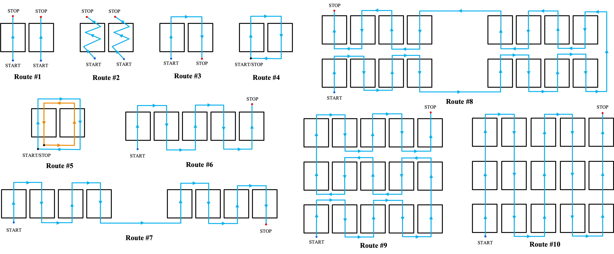
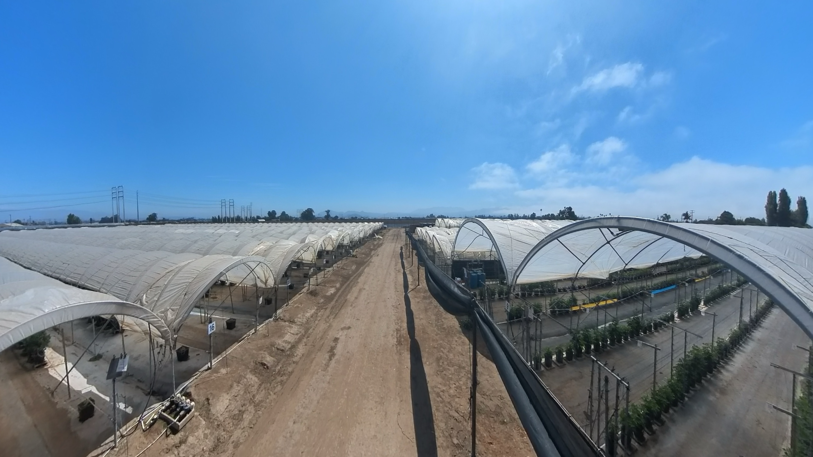

# AgriNav-Sim2Real: A Multi-Sensor Dataset for Drone/UGV Navigation in Greenhouses (Synthetic + Real)

> **TL;DR:** Sim-to-real greenhouse navigation dataset: Unreal/AirSim (RGB, depth, segmentation, IMU, GPS, LiDAR) + handheld farm runs (ZED2i RGB-D, Alvium NIR, IMU). Comes with a consistent folder layout, lightweight metadata, and starter loaders/baselines for perception-to-control under canopy/clutter.

## 1) Dataset Overview 

You can download our dataset from <span style='font-size:25px;'>&#128073;</span> <a href="https://ucla.box.com/s/be2bwg0l6qg6p8mcfbr48e7u5yatfk5y">here</a>.

- **Data Sources**
  - **Synthetic (Unreal Engine + AirSim)**: RGB, **Depth**, **Semantic Segmentation**, **IMU**, ground-truth pose; 3×5 connected-greenhouse map; 10 canonical routes (loop, straight pass, zig-zag, in/out).
  - **Real: Handheld system (Farm runs)**: **ZED2i RGB-D** (stereo depth), **Alvium 1800 U-501 NIR** (near-infrared), **FLIR Lepton LWIR** (capable but **not captured in this release**), onboard compute: **Jetson Nano NX** companion computer; plus IMU logging.

- **Intended Tasks**
  - Navigation & obstacle avoidance (RGB / RGB-D + IMU).
  - Depth estimation & semantic segmentation (synthetic GT).
  - Cross-modal fusion (RGB + NIR; RGB-D) and domain adaptation.
  - Sim-to-real transfer: train on synthetic → evaluate on Insta360/handheld farm data.

- **Why this dataset**: Combines clean synthetic supervision (depth/seg/pose) with real video realism for sim-to-real transfer; unified format means you can train once and evaluate everywhere.

> **Modalities at a glance**
> - **Synthetic:** RGB, Depth, Segmentation, IMU, Pose  
> - **Handheld:** RGB-D (ZED2i), NIR (Alvium 1800 U-501), IMU

## Part A — Synthetic Dataset 

### A.1 Environment Overview
*Engine & Sim:* Unreal Engine + AirSim with a 3×5 connected-greenhouse map, dynamic lights, wind, and clutter.

> **Visuals: Greenhouse Setup** 
<table align="center">
  <tr align="center">
    <td align="center">
      <br>
      <em>Front view</em>
    </td>
    <td align="center">
      <br>
      <em>Side view</em>
    </td>
  </tr>
</table>


> **Demo Video**  
<p align="center">
  
</p>
<p align="center">
  <a href="docs/media/Greenhouse_visual.mp4">Watch full MP4</a>
</p>

### A.2 Canonical Routes (10) 
Each synthetic sequence belongs to one of **Route #1 … Route #10**; these labels map to the `<route>` level in the folder tree.

<table align="center">
  <tr>
    <td align="center"><br>
      
    </td>
  </tr>
</table>


### A.3 Folder Contents (Synthetic)
Our synthetic data follow a per-route structure; each route contains frame-indexed folders for sensors and two time-series logs.
Our per-frame filenames use **timestamp-based** (e.g., `1753292383498990645`) identifiers shared across modalities.
- `rgb/`, `depth/`, `seg/`, `imu.csv`, `gps.csv`, as detailed below.
- `scenes/` holds domain randomization configs (materials, textures, foliage density).
- `routes/` optional YAMLs describing waypoints used to generate the flights.

```swift
AgriNav-Sim2Real/data/synthetic/routes/
├── route01_left/
│ ├── rgb/                       # 1753292383498990645.png, ...
│ ├── depth/                     # 1753292383498990645.pfm, ...
│ ├── semantic_mask/             # 1753292383498990645.png (uint8 class IDs)
│ ├── lidar/                     # 1753292383498990645.asc (ASCII; x y z [intensity])
│ ├── imu.csv                    # timestamped IMU
│ ├── gps.csv                    # timestamped GPS
├── route02/
└── route10/
```

**Global simulator config (reproducibility):** 

All routes were captured with the same AirSim settings (stored at `data/synthetic/scenes/default/airsim_settings.json`). Key fields used during capture:
- **Sim mode:** `Multirotor`
- **CameraDefaults.CaptureSettings (ImageType 0/1/2/…):**
  - `Width=960, Height=540, FOV_Degrees=90`  *(these are the capture dimensions; the top-level `"Width":1280, "Height":720` is the UE window size, not capture)*  
- **Front camera pose (Drone1/Cameras/frontcamera):**
  - `X=0.25, Y=0, Z=-0.3, Roll=Pitch=Yaw=0`
- **LiDAR (Drone1/Sensors/lidar):**
  - `Enabled=true, NumberOfChannels=32, Range=120 m, RPS=10, MeasurementsPerCycle=1024`
  - Vertical FOV: `+26.8° … −24.8°`, Horizontal FOV: `0…360°`

> **Resolution note:** We record the actual frame size from the files in `rgb/`. If you change `CaptureSettings` between runs, prefer adding a small `meta.json` in that route to pin the exact resolution/fps.

**File formats & sync:**
- `rgb/`: `frame_<6-digit>.png|jpg`
- `depth/`: `depth_<6-digit>.pfm|fpm` *(float meters; PFM origin is bottom-left; loaders typically flip vertically)*
- `semantic_mask/`: `mask_<6-digit>.png` *(uint8 class IDs; optional `palette.json`)*
- `lidar/`: `lidar_<6-digit>.asc` lines: `x y z [intensity]` in sensor frame (meters)
- `imu.csv` header: timestamp, gyro_x, gyro_y, gyro_z, acc_x, acc_y, acc_z
- `gps.csv` header: timestamp, latitude, longitude, altitude

**AirSim settings file:** 
See the exact configuration in `data/synthetic/scenes/default/airsim_settings.json`.

### A.4 Camera intrinsics (Synthetic, summary) 

- Capture: `W=960`, `H=540`, `HFOV=90°` → pinhole intrinsics (px):
  - `fx=480.0`, `fy=480.0`, `cx=480.0`, `cy=270.0`
- Distortion: all zeros (AirSim pinhole)
- Resize rule: scale `fx, fy, cx, cy` by the same width/height factors
- Crop rule: subtract crop origin from `cx,cy`
- Config file: `data/synthetic/scenes/default/airsim_settings.json`

<details>
  <summary><b>Quick sanity check (click to expand)</b></summary>

**Goal:** Confirm the camera intrinsics used in this README are correct for your build.

**Setup:**
1) In the sim, place a **1.00 m wide** rectangular target (or cube) centered in front of the camera at a known distance, e.g., **Z = 2.00 m**.
2) Capture an RGB frame at the dataset resolution (**960×540**).

**What to measure:**
- Measure the target’s **pixel width** in the image (any image viewer with a ruler works).

**Expected pixel width (pinhole model):** 
```math
\text{px}_{\text{pred}} \approx f_x \cdot \frac{W_{\text{m}}}{Z_{\text{m}}}.
With f_x=480, W_{\text{m}}=1.0, Z_{\text{m}}=2.0:
\mathrm{px}_{\text{pred}} \approx 480 \cdot \frac{1.0}{2.0} \approx \mathbf{240\ \text{px}}.
```
 
**Interpretation:**
- You observe **≈ 240 px** → the README intrinsics (`fx=fy=480, cx=480, cy=270`) are correct for **HFOV = 90°**.
- You observe **≈ 135 px** → your build likely used **VFOV = 90°** on 960×540 (then `fx=fy≈270`).
- Different value? Check you used the same **distance Z** and **target width W**; also verify any **resizing/cropping** (see rules above) and recalc `fx,fy,cx,cy`.

**Note:** Unreal’s top-level window size can differ from the capture size. We use the **per-camera CaptureSettings** (`Width=960, Height=540, FOV_Degrees=90`) for computing intrinsics.

</details>

## Part B — Real Dataset 

### B.1 Overview 
- **Site:** Driscoll's Farm <!-- check if need to add address after the meeting-->
- **Capture rigs (primary):**
  - **ZED2i RGB-D** (stereo) + **IMU**
  - **Alvium 1800 U-501** **NIR**
  - **FLIR Lepton** **LWIR** (capable; **not captured in this release**)
  - Onboard compute: **Jetson Nano NX**
- **360° context:** **Insta360 X3** (equirectangular RGB) for environmental overviews and qualitative sim-to-real checks
- **Carriers:** handheld / UGV / drone (depending on session)
- **Notes:** Not all modalities may be present in every session; see per-session folders and `notes.md` for specifics.

>**Visuals:**
<table align="center">
  <tr align="center">
    <td align="center"><br>
      <br>
      <em>Farm overview (left)</em>
    </td>
    <td aligh="center"><br>
      <br>
      <em>Farm overview (center)</em>
    </td>
    </td>
    <td aligh="center"><br>
      <br>
      <em>Farm overview (right)</em>
    </td>
  </tr>
</table>
<p align="center">
  <a href="https://cloud-va.insta360.com/share/va/2a8h819p6D9s2U7k1172661248/player?mediaId=288041035899080704">
    Watch 360° view of the farm
  </a>
</p>

> **Demo Video**  
<p align="center">
  
</p>
<p align="center">
  <a href="https://ucla.app.box.com/file/1952972039846">Watch full MP4</a>
</p>


### B.2 Folder Contents (Real)
- `real_insta360/raw/` original `.insv/.mp4` + device metadata.
- `real_insta360/extracted/<site>/<session>/` de-warped views and `meta.json`, optional `gps_imu.csv`.
- `real_farm/<site>/<session>/` forward RGB (±Depth/IMU), `calib/`, and `notes.md`.

```swift
AgriNav-Sim2Real/data/real/
├── Temps/                       # overview photos of the farm/site
│ ├── Farm_1.jpg
│ ├── Farm_2.jpg
│ └── Farm_*.jpg
├── Insta360/                    # 360° context: walk-throughs (enter/exit tunnel)
│ ├── Videos/                    # original .insv/.mp4 from Insta360 X3
│ │ └── VID_20250807_103618_10_068_02_07.mov
│ │ ├── frames/                  # extracted frames
└── Driscoll_farm/               # primary multi-sensor farm data
│ ├── rgb/                       # *.png (e.g., <timestamp>.png)
│ ├── depth/                     # *.png (16-bit or 32-bit; see note below)
│ ├── nir/                       # *.png (Alvium 1800 U-501)
│ ├── imu.csv                    # time-series IMU (see schema)
```
**What each part contains**
- **`Temps/`**: overview stills of the site (for README and qualitative context).
- **`Insta360/`**: 360° equirectangular videos from walk-throughs (entering/exiting tunnels).  
  *Tip:* if you de-warp to pinhole “front/left/right”, keep those under `sessions/<name>/rgb_views/`.
- **`Driscoll_farm/`**: the **primary research data**—per-session folders with **RGB**, **Depth**, **NIR**, and **IMU**.

**IMU CSV schema (Driscoll_farm/***session***)**
